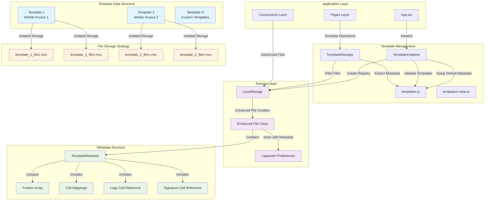
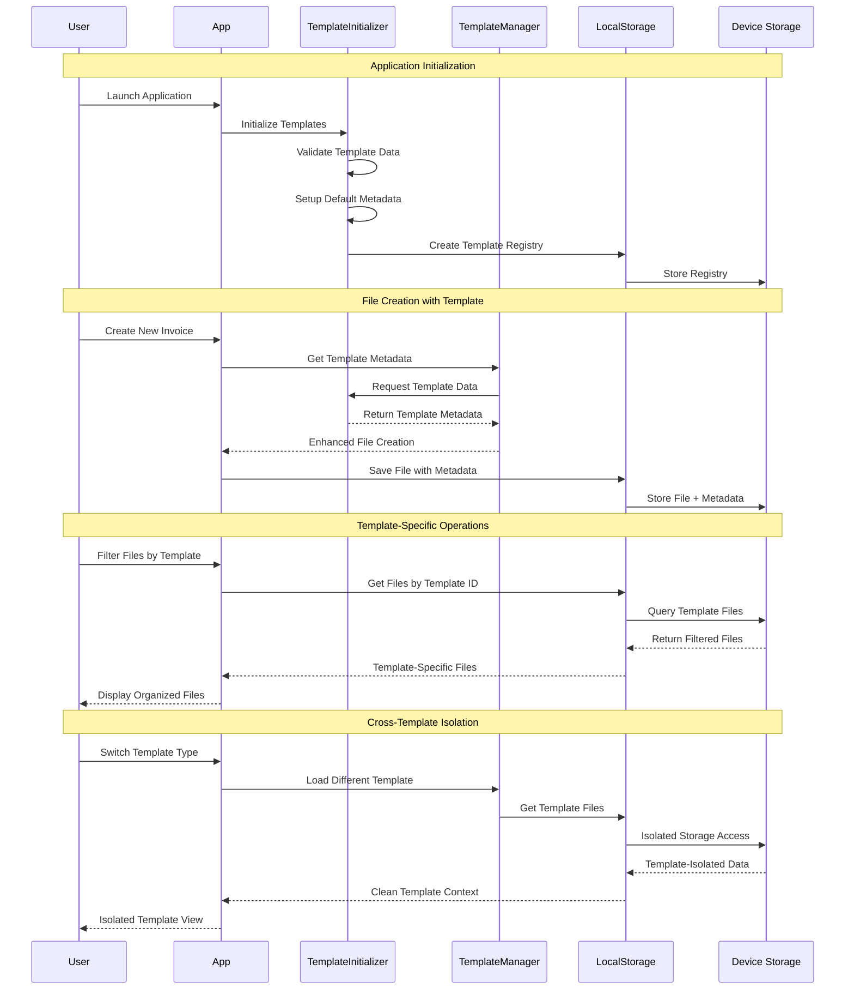
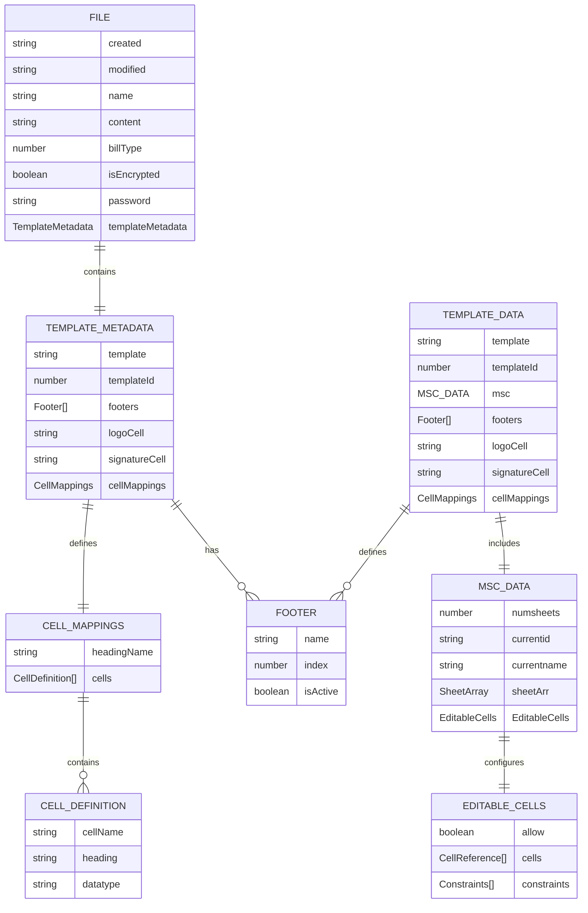
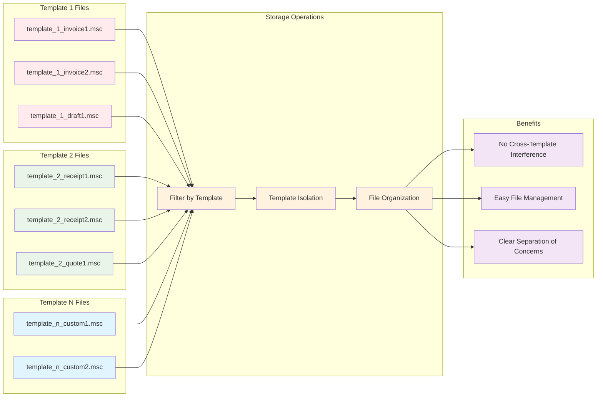

# Multi-Template Architecture Diagram

```mermaid
graph TB
    subgraph "Application Layer"
        App[App.tsx]
        Pages[Pages Layer]
        Components[Components Layer]
    end

    subgraph "Template Management"
        TI[TemplateInitializer]
        TM[TemplateManager]
        TD[templates.ts]
        TMeta[templates-meta.ts]
    end

    subgraph "Storage Layer"
        LS[LocalStorage]
        File[Enhanced File Class]
        Preferences[Capacitor Preferences]
    end

    subgraph "Template Data Structure"
        T1[Template 1<br/>Mobile Invoice 1]
        T2[Template 2<br/>Mobile Invoice 2]
        TN[Template N<br/>Custom Templates]
    end

    subgraph "File Storage Strategy"
        F1[template_1_file1.msc]
        F2[template_1_file2.msc]
        F3[template_2_file1.msc]
        F4[template_2_file2.msc]
    end

    subgraph "Metadata Structure"
        Meta[TemplateMetadata]
        Footers[Footers Array]
        CellMap[Cell Mappings]
        LogoCell[Logo Cell Reference]
        SigCell[Signature Cell Reference]
    end

    %% Initialization Flow
    App -->|Initialize| TI
    TI -->|Setup Default Metadata| TD
    TI -->|Validate Templates| TD
    TI -->|Create Registry| LS

    %% Template Management Flow
    Pages -->|Template Operations| TM
    TM -->|Extract Metadata| TD
    TM -->|Filter Files| LS
    
    %% Storage Flow
    Components -->|Save/Load Files| LS
    LS -->|Enhanced File Creation| File
    File -->|Store with Metadata| Preferences
    
    %% Template Isolation
    T1 -->|Isolated Storage| F1
    T1 -->|Isolated Storage| F2
    T2 -->|Isolated Storage| F3
    T2 -->|Isolated Storage| F4
    
    %% Metadata Flow
    File -->|Contains| Meta
    Meta -->|Includes| Footers
    Meta -->|Includes| CellMap
    Meta -->|Includes| LogoCell
    Meta -->|Includes| SigCell

    %% Styling
    classDef templateClass fill:#e1f5fe
    classDef storageClass fill:#f3e5f5
    classDef metadataClass fill:#e8f5e8
    classDef fileClass fill:#fff3e0

    class T1,T2,TN templateClass
    class LS,File,Preferences storageClass
    class Meta,Footers,CellMap,LogoCell,SigCell metadataClass
    class F1,F2,F3,F4 fileClass
```

## Architecture Flow Diagram

```mermaid
sequenceDiagram
    participant User
    participant App
    participant TI as TemplateInitializer
    participant TM as TemplateManager
    participant LS as LocalStorage
    participant Storage as Device Storage

    Note over User,Storage: Application Initialization
    User->>App: Launch Application
    App->>TI: Initialize Templates
    TI->>TI: Validate Template Data
    TI->>TI: Setup Default Metadata
    TI->>LS: Create Template Registry
    LS->>Storage: Store Registry

    Note over User,Storage: File Creation with Template
    User->>App: Create New Invoice
    App->>TM: Get Template Metadata
    TM->>TI: Request Template Data
    TI-->>TM: Return Template Metadata
    TM-->>App: Enhanced File Creation
    App->>LS: Save File with Metadata
    LS->>Storage: Store File + Metadata

    Note over User,Storage: Template-Specific Operations
    User->>App: Filter Files by Template
    App->>LS: Get Files by Template ID
    LS->>Storage: Query Template Files
    Storage-->>LS: Return Filtered Files
    LS-->>App: Template-Specific Files
    App-->>User: Display Organized Files

    Note over User,Storage: Cross-Template Isolation
    User->>App: Switch Template Type
    App->>TM: Load Different Template
    TM->>LS: Get Template Files
    LS->>Storage: Isolated Storage Access
    Storage-->>LS: Template-Isolated Data
    LS-->>App: Clean Template Context
    App-->>User: Isolated Template View
```

## Data Structure Diagram

```mermaid
erDiagram
    FILE {
        string created
        string modified
        string name
        string content
        number billType
        boolean isEncrypted
        string password
        TemplateMetadata templateMetadata
    }

    TEMPLATE_METADATA {
        string template
        number templateId
        Footer[] footers
        string logoCell
        string signatureCell
        CellMappings cellMappings
    }

    FOOTER {
        string name
        number index
        boolean isActive
    }

    CELL_MAPPINGS {
        string headingName
        CellDefinition[] cells
    }

    CELL_DEFINITION {
        string cellName
        string heading
        string datatype
    }

    TEMPLATE_DATA {
        string template
        number templateId
        MSC_DATA msc
        Footer[] footers
        string logoCell
        string signatureCell
        CellMappings cellMappings
    }

    MSC_DATA {
        number numsheets
        string currentid
        string currentname
        SheetArray sheetArr
        EditableCells EditableCells
    }

    EDITABLE_CELLS {
        boolean allow
        CellReference[] cells
        Constraints[] constraints
    }

    FILE ||--|| TEMPLATE_METADATA : contains
    TEMPLATE_METADATA ||--o{ FOOTER : has
    TEMPLATE_METADATA ||--|| CELL_MAPPINGS : defines
    CELL_MAPPINGS ||--o{ CELL_DEFINITION : contains
    TEMPLATE_DATA ||--|| MSC_DATA : includes
    TEMPLATE_DATA ||--o{ FOOTER : defines
    MSC_DATA ||--|| EDITABLE_CELLS : configures
```

## Storage Isolation Diagram

```mermaid
graph LR
    subgraph "Template 1 Files"
        T1F1[template_1_invoice1.msc]
        T1F2[template_1_invoice2.msc]
        T1F3[template_1_draft1.msc]
    end

    subgraph "Template 2 Files"
        T2F1[template_2_receipt1.msc]
        T2F2[template_2_receipt2.msc]
        T2F3[template_2_quote1.msc]
    end

    subgraph "Template N Files"
        TNF1[template_n_custom1.msc]
        TNF2[template_n_custom2.msc]
    end

    subgraph "Storage Operations"
        Filter[Filter by Template]
        Isolate[Template Isolation]
        Organize[File Organization]
    end

    subgraph "Benefits"
        NoInterference[No Cross-Template Interference]
        EasyManagement[Easy File Management]
        ClearSeparation[Clear Separation of Concerns]
    end

    T1F1 --> Filter
    T1F2 --> Filter
    T1F3 --> Filter
    T2F1 --> Filter
    T2F2 --> Filter
    T2F3 --> Filter
    TNF1 --> Filter
    TNF2 --> Filter

    Filter --> Isolate
    Isolate --> Organize
    Organize --> NoInterference
    Organize --> EasyManagement
    Organize --> ClearSeparation

    %% Styling
    classDef template1 fill:#ffebee
    classDef template2 fill:#e8f5e8
    classDef templateN fill:#e1f5fe
    classDef operation fill:#fff3e0
    classDef benefit fill:#f3e5f5

    class T1F1,T1F2,T1F3 template1
    class T2F1,T2F2,T2F3 template2
    class TNF1,TNF2 templateN
    class Filter,Isolate,Organize operation
    class NoInterference,EasyManagement,ClearSeparation benefit
```
