# 🏛️ Government Medical Billing Form

A comprehensive Progressive Web Application (PWA) built with Ionic 8 and React for government invoice billing with advanced offline capabilities, modern UI/UX, and cross-platform compatibility.

## Project Overview

The Government Billing Solution MVP is a modern, feature-rich billing application designed specifically for government agencies and public sector organizations. Built as a Progressive Web App, it provides a native app-like experience while maintaining web accessibility and cross-platform compatibility.

## Device Support (Web, Android, Ios, PWA)

```mermaid
flowchart TD
    A([💻 Device Support]) --> B[Desktop Web]
    A --> C[Android]
    A --> D[iOS]
    A --> E[PWA]
```



## 🗂️ Project Structure

```
src/
├── components/           # Reusable UI components
│   ├── Files/           # File management components
│   ├── FileMenu/        # File operations menu
│   ├── Menu/            # Application menu
│   ├── socialcalc/      # Spreadsheet engine
│   └── Storage/         # Local storage management
├── contexts/            # React contexts for state management
├── hooks/               # Custom React hooks
├── pages/              # Main application pages
├── services/           # Application services
├── theme/              # CSS themes and variables
└── utils/              # Utility functions
```

# C4GT DMP'25 Contributions:

## 📋 Features

### 🏠 Core Application Features


| **Feature** | **Description**        | **Status**                                                          |
| ----------- | ---------------------- | ------------------------------------------------------------------- | ----------- |
| **1**       | **Spreadsheet Editor** | Full-featured invoice creation with calculations and formatting     | ✅ Complete |
| **2**       | **File Management**    | Local file storage with search, sort, and organization capabilities | ✅ Complete |
| **3**       | **PWA Capabilities**   | Offline functionality, app installation, and native-like experience | ✅ Complete |
| **4**       | **Cross-Platform**     | Works on mobile, tablet, and desktop with responsive design         | ✅ Complete |
| **5**       | **Theme Support**      | Dark and light themes with user preference persistence              | ✅ Complete |
| **6**       | **Invoice Templates**  | Pre-built templates for various government billing scenarios        | ✅ Complete |
| **7**       | **PDF Export**         | Generate PDF invoices with professional formatting                  | ✅ Complete |
| **8**       | **Image Integration**  | Add logos, signatures, and images to invoices                       | ✅ Complete |
| **9**       | **Camera Integration** | Take photos directly within the app for invoice documentation       | ✅ Complete |
| **10**      | **Data Security**      | Client-side encryption and secure local storage                     | ✅ Complete |


## 1. Offline Features

## 2. Cloud Features (AWS S3)

```mermaid
flowchart TD
    A([☁️ Cloud Features]) --> B[Export Pdf]
    A --> C[Cloud Sync]
    A --> D[Multi Save/Retrieve]
    C --> F[Save]
    C --> G[Retrieve]
```

## 3. Blockchain Integration (Starknet)

```mermaid
flowchart TD
    A([⛓️ Starknet Integration]) --> B[Subscription Plans]
    A --> C[Blockchain Sync]
    A --> D[IPFS Storage]
    B --> G[5 Files, 1 PPT]
    B --> H[50 Files, 10 PPT]
    B --> I[250 Files, 50 PPT]

    C --> E[Save]
    C --> F[Retrieve]
```


### 📱 Progressive Web App Features

- **Offline Functionality**: Full app functionality without internet connection
- **App Installation**: Install directly from browser with native app experience
- **Background Sync**: Sync data when connection is restored
- **Push Notifications**: Local notifications for important events
- **App Shortcuts**: Quick access to create invoice, view invoices, and manage customers
- **Standalone Display**: Full-screen app experience when installed
- **App-like UI**: Native-feeling interface with proper theming
- 
#### 📊 Performance Metrics

- **Load Times**: Measure initial load and navigation performance
- **Cache Hit Rates**: Monitor offline capability effectiveness
- **Storage Usage**: Track local storage and quota usage

## 🛠️ Technology Stack

### Frontend Framework

- **React 18.2.0** - Modern UI library with hooks and concurrent features
- **TypeScript 5.1.6** - Type-safe development environment
- **Ionic 8.0.0** - Cross-platform UI components and native app features
- **Vite 5.0.0** - Fast build tool and development server

### PWA & Mobile

- **Vite PWA Plugin 0.19.0** - Progressive Web App capabilities
- **Capacitor 6.0.0** - Native app deployment for iOS and Android
- **Capacitor Plugins** - Camera, filesystem, preferences, and sharing capabilities

### Spreadsheet Engine

- **SocialCalc** - Powerful spreadsheet engine for invoice creation and calculation
- **Custom Extensions** - Enhanced functionality for government billing needs


## 🚀 Quick Start

### Prerequisites

- **Node.js 16+** (LTS recommended)
- **npm 8+** or **yarn 1.22+**

### Installation

```bash
# Clone the repository
git clone https://github.com/<your_username>/<repo_name>.git
cd <repo_name>

# Install dependencies
npm install

# Generate PWA assets (icons, manifest)
npm run generate-pwa-assets

# Start development server
npm run dev
or ionic serve

# Build for production
npm run build
or ionic build

# Preview production build
npm run preview
```

### Mobile Development

```bash
# Add Capacitor (if not already added)
ionic integrations enable capacitor

# Add mobile platforms
npx cap add android
npx cap add ios

# Sync web app with native platforms
npx cap sync

# Open in native IDEs
npx cap open android
npx cap open ios

# (Optional) Run on mobile
ionic capacitor run android -l --external
ionic capacitor run ios -l --external
```

## 🤝 Contributing

1. Fork the repository
2. Create your feature branch (`git checkout -b feature/AmazingFeature`)
3. Commit your changes (`git commit -m 'Add some AmazingFeature'`)
4. Push to the branch (`git push origin feature/AmazingFeature`)
5. Open a Pull Request

## 📄 License

This project is licensed under the MIT License - see the [LICENSE](LICENSE) file for details.

## 🙏 Acknowledgments

- Built with [Ionic Framework](https://ionicframework.com/)
- Powered by [React](https://reactjs.org/)
- Spreadsheet functionality by [SocialCalc](https://socialcalc.org/)
- PWA capabilities with [Vite PWA Plugin](https://vite-pwa-org.netlify.app/)

## 📞 Support

For support, email the Contributor [anis42390@gmail.com] or create an issue in this repository.

---

**Made with ❤️ under C4GT DMP'25 Program**
